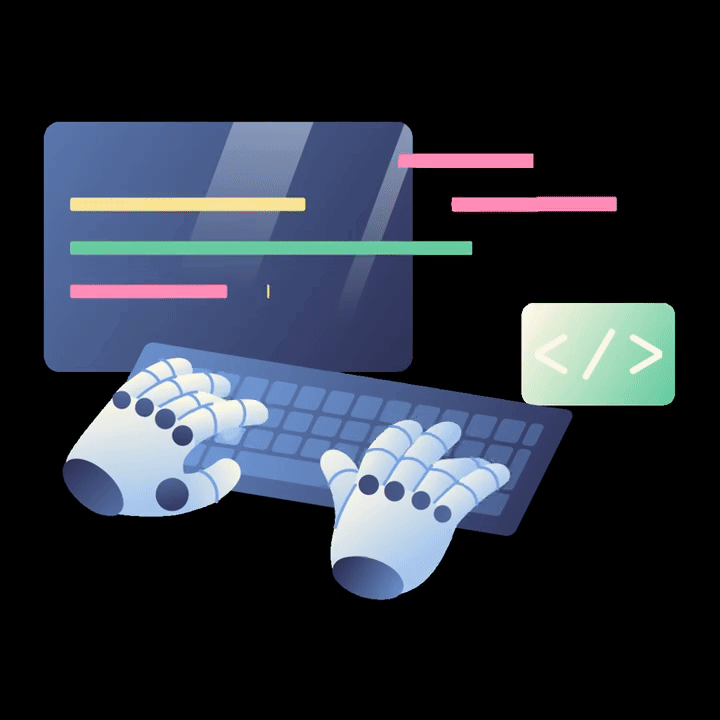

# Hey there I'm Ragavi

  

## <picture></picture> About me

<picture> </picture>

 

I build things the hard way by learning fast, shipping often, and fixing what breaks until it works better than before.
From Flutter apps to full-stack systems, I like owning problems end-to-end, leading when needed, and staying obsessed with clean, useful products.
Still learning, always grinding , I work hard, I rest when I need to, and I show up again - that’s how I grow.

  

## <b> What I Do</b>
 

- Build **cross-platform mobile apps** using Flutter & React Native  
- Develop **modern web apps** with React, Tailwind CSS & Astro  
- Work with **Firebase, MongoDB, MySQL** for backend & data  
- Lead teams and convert ideas into working products  
---
## ##  <b>What I Do</b>

## ⭐ Core Skills
       

## 🧩 Frameworks & UI
   

## 🗄️ Databases & Backend
   

## 🛠️ Tools & Platforms
  

## 🌱 Currently Learning
   

## 🚀 Featured Projects

### 🔹 PrepWise – Personalized IT Prep Companion  
📱 Flutter, Dart, Firebase, SQLite  
- AI-powered interview preparation platform  
- LeetCode progress tracking, mock interviews, ATS resume evaluation  
🔗 https://github.com/ragavit-kec/prepwise

---

### 🔹 Finance Management App  
📱 React Native, MongoDB  
- Track income, expenses, and savings  
- Team-led project with real-world finance use cases  

---

### 🔹 Waste Management App  
📱 Flutter, Firebase  
- Reward-based waste disposal system  
- Geolocation & gamification for sustainability  

---

### 🔹 Healthcare App (Internship Project)  
📱 Flutter, Firebase  
- Doctor appointments, pharmacy orders, bill payments  
- Built during internship at Crescent Moon Consulting Services  

---

## 🏆 Experience Highlights

- **App Developer – Crescent Moon Consulting Services**  
- **Team Lead – Lights.Inc (Finance Management App)**  
- **Java Developer Intern – CodSoft**  
- **Web Development Intern – CodSoft**

---

## 🏅 Achievements

- 🥇 Winner – Technical Presentation (1st & 2nd Year)  
- 🥇 Winner – KEC Hackathon 2025 (State Level)  
- 🥈 Winner – Thinkathon (Vellar College of Engineering)  
- 🥉 Winner – HackWave Intra-Department Hackathon  

---

## 📊 GitHub Stats

---

## 📫 Connect With Me

- 💼 LinkedIn: http://www.linkedin.com/in/ragavi2005  
- 🌐 Portfolio: https://portfolio-delta-five-25.vercel.app  
- 📧 Email: ragavithangaraj09@gmail.com  

⭐ If you like my work, feel free to explore my repositories and connect with me!
